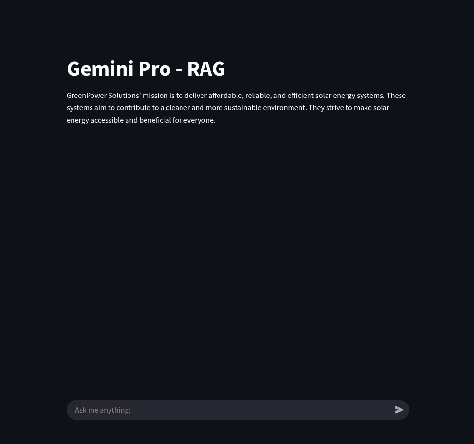

# AI Chatbot using Streamlit, ChromaDB, and Gemini Pro  

This project is a **Retrieval-Augmented Generation (RAG) chatbot** built using **Streamlit** for the frontend, **ChromaDB** as the vector database, and **Gemini Pro** for response generation. It enables users to interact with an AI assistant that retrieves relevant knowledge before generating responses, ensuring accurate and context-aware conversations.  

## 🚀 Features  
- **Streamlit Frontend** – Provides an interactive and user-friendly web interface.  
- **ChromaDB Vector Store** – Efficiently stores and retrieves document embeddings for enhanced contextual responses.  
- **Gemini Pro API** – Powers chatbot responses with advanced language models.  
- **Knowledge Retrieval System** – Ensures responses are backed by relevant document context.  
- **Optimized RAG Pipeline** – Combines retrieval and generation for informed and precise interactions.  

## 🔧 How It Works  
1. **Load Documents** – Ingests and embeds text data into ChromaDB for efficient retrieval.  
2. **User Query** – Accepts input via a Streamlit-based web interface.  
3. **Context Retrieval** – Fetches relevant information from ChromaDB.  
4. **Response Generation** – Uses Gemini Pro to generate responses based on retrieved context.  

This project is ideal for **AI-powered knowledge retrieval, customer support automation, and research assistance.** 🚀💡  

 

## 🛠 Installation & Setup  
Before running the application, create a `.env` file from `.env.sample` and you will need to set the following environment variable to your .env file `GOOGLE_API_KEY`

1. Clone the repository:  
   ```bash
   git clone https://github.com/smrussel/gemini-pro-rag.git
   cd gemini-pro-rag
    ```
2. Install dependencies:
    ```bash
    pip install -r requirements.txt
    ```
3. Run the chatbot:
    ```bash
    streamlit run app.py
    ```

## 📌 Dependencies
    * Python 3.10
    * Streamlit
    * Chromadb
    * Gemini Pro API
    * Langchain 


## Streamlit Chabot Screenshot



## 📜 License
This project is licensed under the [MIT](LICENSE) License.